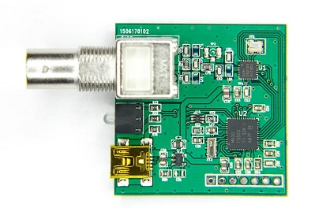
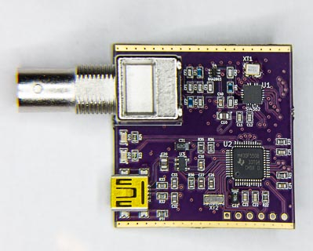
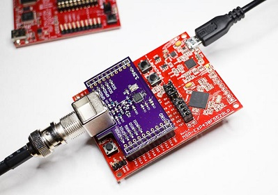

dAISy USB Firmware Updates
==========================

This folder contains firmware updates for dAISy receivers, also known as dAISy USB.

Firmware Revisions
------------------

* **4.02** Significantly improved reception of AIS messages over previous revisions. Greatly reduces number of errors, particularly for weak signals (below -80 dBm).
* **4.03** Finetuned crystal frequency to be closer to 30 MHz on average. Only minor improvement over 4.02, if any at all.
* **4.04** Fixed reading channel configuration from FLASH memory. Added debug option with TAB separated output for easier post processing of debug data.

Hardware Variants
-----------------

There currently are 4 versions of the dAISy USB hardware. Make sure you download the right firmware for your version of dAISy!

**hw3: dAISy USB 3 - square 2, MSP430F5503 MCU**

This is the version [that I currently sell on Tindie](https://www.tindie.com/products/astuder/daisy-ais-receiver/).
Note that the MSP430 MCU is in a QFN package. Text on the back says "dAISy USB 3". PCB color can vary.
Right-click *[here](https://github.com/astuder/dAISy/raw/master/Firmware/Daisy_hw3_fw4_04.txt)* to download firmware.

**hw2: dAISy USB 2 - square 1, MSP430F5508 MCU**

This was the first version sold on Tindie. Note the MCU is in a QFP package (with leads). Text on the back says "dAISy USB 2".
PCB color can vary. Right-click *[here](https://github.com/astuder/dAISy/raw/master/Firmware/Daisy_hw2_fw4_04.txt)* to download firmware.

**hw1: dAISy USB - the stick, MSP430F5508 MCU**

The first version, mostly sold during 2014. Text on the back says "dAISy USB". Only a few brave souls have these :)
Right-click *[here](https://github.com/astuder/dAISy/raw/master/Firmware/Daisy_hw1_fw4_04.txt)* to download firmware.

**hw0: dAISyPack - BoosterPack for the MSP430F5529 LaunchPad**

For the tinkerers among us. Text on the back says "dAISyPack".
Right-click *[here](https://github.com/astuder/dAISy/raw/master/Firmware/Daisy_hw0_fw4_04.txt)* to download firmware.

Updating the Firmware
---------------------

To update the firmware, you need the programming software from TI. It's part of a bigger package, but for your convenience I made the relevant executable available [here](http://www.adrianstuder.com/daisy/BSL_USB_GUI.zip) (sorry, Windows only)

If you are currently running a firmware version older than 4.0, you will also need to update dAISy's USB driver. Use [this driver](http://www.adrianstuder.com/daisy/daisyUSB%20inf%20v2.zip), when Windows prompts you for a new driver after the upgrade.

**Upgrade procedure**

1.	Connect to dAISy with a terminal program.

2.	Enter bootloader mode.
	- Enter the debug menu by pressing *ESC*.
	- Start the boot loader by pressing *B*.
	
3.	Close the terminal program.

4.	Start *BSL_USB_GUI.exe*.

5.	Press *Next*, accept agreement, press *Next*.

6.	Choose option *Select Firmware* and browse to the firmware file provided.
	
	**IMPORTANT**: *DO NOT* program dAISy with the LED and Echo examples, it will brick the device!

7.	The *Upgrade Firmware* button should be active and “Found 1 device” is displayed below the button.
	- If not, make sure dAISy is connected and you entered bootloader mode as described above.
	- If that does not work, connect dAISy directly to your computer without a USB hub and try again.
	
8.	Press Upgrade Firmware.
	
	The upgrade should only take a few seconds.
	If the firmware upgrade fails with an error, make sure you use the correct firmware file.
	After a failed FW update, dAISy will usually start in bootloader mode. Retry this procedure starting
	at step 4.

9.	After successful upgrade, dAISy should be available again.

	In some cases you might need to disconnect and reconnect dAISy.

10.	The version information in the debug menu should now read:

	*dAISy USB v4.0x* followed by hardware information, e.g. *dAISy USB 3 (5503)*

Please let me know if you run into any issues.
