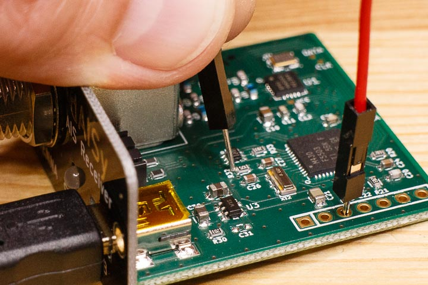

# Un-bricking dAISy

When the firmware update is interrupted, or the wrong firmware file was uploaded, dAISy me be unresponsive. This page describes the procedure to revive dAISy. 

## Is it truly bricked?

Before doing it the hard way, verify the following steps:

1. Unplug dAISy from your computer, wait a few seconds, and plug it in again. Does Windows make a sound and detect a USB device?

2. Start *BSL_USB_GUI.exe* and click Next and accept the agreement. Does it say "Found 1 device" under the Upgrade Firmware button?

If the above is true, you are lucky and dAISy is still alive. It recovered from a failed firmware update and entered the bootloader. 
You can try again to upgrade the firmware by starting at step 6 of the [update instructions](./readme.md#updating-the-firmware). Make sure you select the correct version, contact me if in doubt.
If upgrade fails repeatedly, try without USB hub or from a different PC.

If dAISy is not detected by the BSL USB GUI tool, then it is truly bricked.

## Un-bricking procedure

Follow the steps below to manually force dAISy into boot loader mode.

1. Unplug dAISy's USB cable from your computer.

2. Remove the two screws on the front and slide the circuit board out of the enclosure.

3. Orient the circuit board so that the USB port is pointing to the left.

4. Use a piece of wire and stick one end into the pad marked with 3V3 (3rd hole from left).

5. With one hand, hold the other end of the wire to the left end of resistor R32 as shown below.

6. With the other hand, plug the USB cable back into the computer - you should hear the USB detect sound of Windows.

7. Remove the wire.

8. dAISy should now be in boot loader mode and you can retry the firmware upgrade starting at step 5 of the [upgrade instructions](./readme.md#updating-the-firmware).

If all this fails, or simply sounds too complicated, please contact me and I will exchange your bricked dAISy for a working one.
